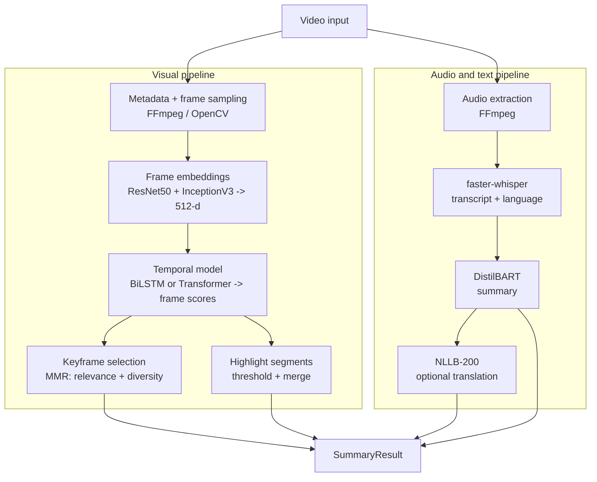

# 🎬 VideoSummarizer AI

A multimodal video summarization prototype. Give it a video and it returns a **text summary**, a set of **diverse keyframes**, **highlight segments**, and an optional **translation** into 200+ languages.

It combines computer vision (pretrained CNN features + temporal modelling), speech recognition (Whisper), abstractive summarization (DistilBART) and machine translation (NLLB-200), served through a Streamlit UI and a Flask REST API, and packaged with Docker.

> **Status:** working prototype. The pipeline runs end to end, but the temporal scoring model is not trained yet. See [Current Status & Limitations](#current-status--limitations) for an honest breakdown.

---

## Features

- 🎞️ **Keyframe extraction**: frames are embedded with an ensemble of ResNet50 and InceptionV3, then selected with Maximal Marginal Relevance (MMR) so the chosen frames are diverse, not near-duplicates.
- 🎙️ **Speech to text**: transcription with `faster-whisper` (CTranslate2 backend), with automatic language detection.
- 📝 **Abstractive summary**: transcript summarized with `sshleifer/distilbart-cnn-12-6`.
- 🌍 **Translation**: summary translated with Meta's NLLB-200 (language names such as `"hindi"` are resolved to NLLB codes).
- ✂️ **Highlight reel**: high-scoring segments are merged and cut into a highlight video (optional).
- 🖥️ **Two interfaces**: Streamlit web UI and Flask REST API.
- 🐳 **Docker ready**: Dockerfile included, configured for Hugging Face Spaces (port 7860).

---

## How it works

The system runs two independent pipelines on the same video and returns their outputs together.



### Pipeline steps (`pipeline.py`)

1. **Frame sampling**: frames are sampled at `sample_fps` (not every frame; neighbouring frames are near-identical, so this keeps cost down).
2. **Visual embeddings**: each frame goes through ResNet50 (224x224) and InceptionV3 (299x299). Both use ImageNet-pretrained weights with the classifier head removed (2048-d each). The features are concatenated (4096-d) and projected to 512-d (`Linear -> LayerNorm -> GELU`).
3. **Temporal scoring**: the sequence of embeddings `(1, T, 512)` is passed to a sequence model that outputs an importance score in `[0, 1]` per frame. Two options are implemented and switchable through config:
   - **BiLSTM**: 2 layers, bidirectional, MLP scorer head.
   - **Transformer encoder**: sinusoidal positional encoding, 4 layers, 8 heads, pre-LayerNorm.
4. **Keyframe selection (MMR)**: greedily picks frames that maximise `lambda * score - (1 - lambda) * max_cosine_similarity_to_selected` (default `lambda = 0.6`), balancing importance against diversity.
5. **Highlight segments**: frames above a threshold are merged into `(start, end)` segments (gaps under 2 s are joined), optionally rendered to `highlights.mp4`.
6. **Transcription**: audio is extracted to a temporary WAV and transcribed with faster-whisper (beam size 5).
7. **Summarization**: the transcript is summarized with DistilBART (beam search, 4 beams).
8. **Translation (optional)**: the summary is translated with NLLB-200.

---

## Tech stack

| Area | Tools |
| --- | --- |
| Visual features | ResNet50, InceptionV3 (torchvision, ImageNet pretrained) |
| Temporal modelling | PyTorch BiLSTM / Transformer encoder |
| Speech recognition | faster-whisper (Whisper via CTranslate2) |
| Summarization | DistilBART (`sshleifer/distilbart-cnn-12-6`) |
| Translation | Facebook NLLB-200 |
| Video / audio | FFmpeg, OpenCV, MoviePy |
| Serving | Streamlit (UI), Flask (REST API) |
| Packaging | Docker |

---

## Project structure

```
ai-video-summarizer/
├── app.py               # Streamlit web UI
├── server.py            # Flask REST API
├── pipeline.py          # Main orchestrator (VideoSummarizer, SummaryResult)
├── config.py            # Central configuration (models, device, sampling)
├── video_processor.py   # Metadata, frame + audio extraction, highlight reel
├── visual_encoder.py    # ResNet50 + InceptionV3 ensemble encoder
├── temporal_model.py    # BiLSTM and Transformer frame-scoring models
├── frame_selector.py    # MMR keyframe selection, score -> segment conversion
├── audio_pipeline.py    # faster-whisper transcription
├── summarizer.py        # DistilBART summarizer
├── translator.py        # NLLB-200 translator
├── demo.py              # Example script
├── requirements.txt
├── Dockerfile
└── .dockerignore
```

---

## Installation

**Prerequisites:** Python 3.10+ and FFmpeg installed on the system.

```bash
# 1. Clone
git clone https://github.com/Manishagg1406/ai-video-summarizer.git
cd ai-video-summarizer

# 2. Create an environment
conda create -n videosumm python=3.10
conda activate videosumm

# 3. Install Python dependencies
pip install -r requirements.txt

# 4. Install FFmpeg (system level)
# Ubuntu/Debian
sudo apt install ffmpeg
# macOS
brew install ffmpeg
```

Model weights (ResNet50, InceptionV3, Whisper, DistilBART, NLLB-200) are downloaded automatically on first run, so the first run is slow and needs an internet connection.

---

## Usage

### 1. Streamlit UI

```bash
streamlit run app.py
```

Upload a video, choose an optional target language, and view the summary, keyframes and transcript.

### 2. Flask REST API

```bash
python server.py
```

Send a video as `multipart/form-data` to the summarize endpoint. Check `server.py` for the exact routes and parameters.

### 3. Python

```python
from pipeline import VideoSummarizer

vs = VideoSummarizer()   # device comes from config.py

result = vs.summarize(
    "lecture.mp4",
    top_k_frames=8,
    target_lang="hindi",        # optional
    save_highlights=True,       # optional
    highlight_out="highlights.mp4",
)

print(result.summary)
print(result.translated)
print(result.language_detected)
print(result.keyframe_timestamps)   # seconds
result.keyframes[0].show()          # PIL images
```

`SummaryResult` fields: `transcript`, `summary`, `translated`, `language_detected`, `keyframe_indices`, `keyframe_timestamps`, `keyframes`, `highlight_segments`, `highlight_path`, `duration`, `metadata`.

---

## Docker

```bash
docker build -t video-summarizer .
docker run -p 7860:7860 video-summarizer
```

Open `http://localhost:7860`.

The image is based on `python:3.11-slim`, installs FFmpeg, and starts the Streamlit app on port `7860` (the default port for Hugging Face Spaces). The YAML block at the top of this README is the Hugging Face Space configuration (`sdk: docker`), so the repo can be deployed as a Space directly.

---

## Design decisions

| Decision | Reason |
| --- | --- |
| Sample frames at low FPS | Consecutive frames are near-duplicates; sampling cuts compute with little information loss. |
| Two CNNs (ResNet50 + InceptionV3) | Different architectures capture complementary features (residual vs multi-scale). |
| MMR instead of plain top-k | Top-k scoring frames tend to be adjacent and redundant; MMR forces diversity. |
| BiLSTM and Transformer, switchable | Compare local sequential modelling against global self-attention behind one factory (`build_temporal_model`). |
| faster-whisper | Same Whisper models with a faster, lower-memory CTranslate2 runtime. |
| DistilBART | Much smaller and faster than BART-large while keeping most of the summary quality. |
| NLLB-200 | One model covers 200 languages, so no per-language models are needed. |

---

## Current status & limitations

This is a prototype, and these are the known gaps:

- **Temporal model is untrained.** The BiLSTM/Transformer architectures are implemented, but no trained weights are loaded, so frame importance scores are not yet meaningful. Right now keyframe quality comes mainly from the pretrained CNN embeddings and the MMR diversity term. Highlight segments are therefore not reliable.
- **No multimodal fusion.** The visual and audio pipelines run independently. The summary is generated from the transcript only; visual features are used for keyframes and highlights.
- **Long videos are truncated for summarization.** DistilBART accepts at most 1024 tokens, so only the beginning of a long transcript is summarized.
- **Summarizer is English-only.** Non-English speech is transcribed and language-detected, but DistilBART expects English text. NLLB translates only the final summary.
- **CPU-only transcription.** The Whisper model is loaded on CPU regardless of the `device` setting.
- **Models load at startup.** All models are loaded when `VideoSummarizer` is created, which is slow and memory heavy.
- **No evaluation yet.** No benchmark results (e.g. F-score on TVSum/SumMe, ROUGE on summaries) are reported.
- **No tests, logging or job queue.** Requests are processed synchronously.

---

## Roadmap

- [ ] Train the temporal model on TVSum / SumMe and report F-score
- [ ] Hierarchical (chunked map-reduce) summarization for long transcripts
- [ ] Translate non-English transcripts to English before summarizing (or use a multilingual summarizer)
- [ ] Real multimodal fusion (align keyframes with transcript segments by timestamp)
- [ ] Pre-download models in the Docker image to cut cold-start time
- [ ] Async job queue (Celery + Redis) and object storage for large uploads
- [ ] GPU support and lazy model loading
- [ ] Unit tests, structured logging, CI
- [ ] Evaluation: ROUGE / BERTScore for summaries, F-score for keyframes

---

## Author

**Manish Aggarwal** · [GitHub](https://github.com/Manishagg1406)

---

## Acknowledgements

[OpenAI Whisper](https://github.com/openai/whisper) · [faster-whisper](https://github.com/SYSTRAN/faster-whisper) · [Hugging Face Transformers](https://github.com/huggingface/transformers) · [Meta NLLB-200](https://github.com/facebookresearch/fairseq/tree/nllb) · [PyTorch / torchvision](https://pytorch.org)